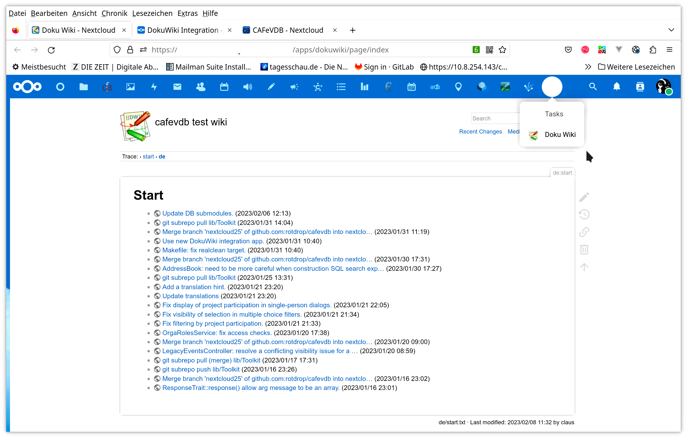
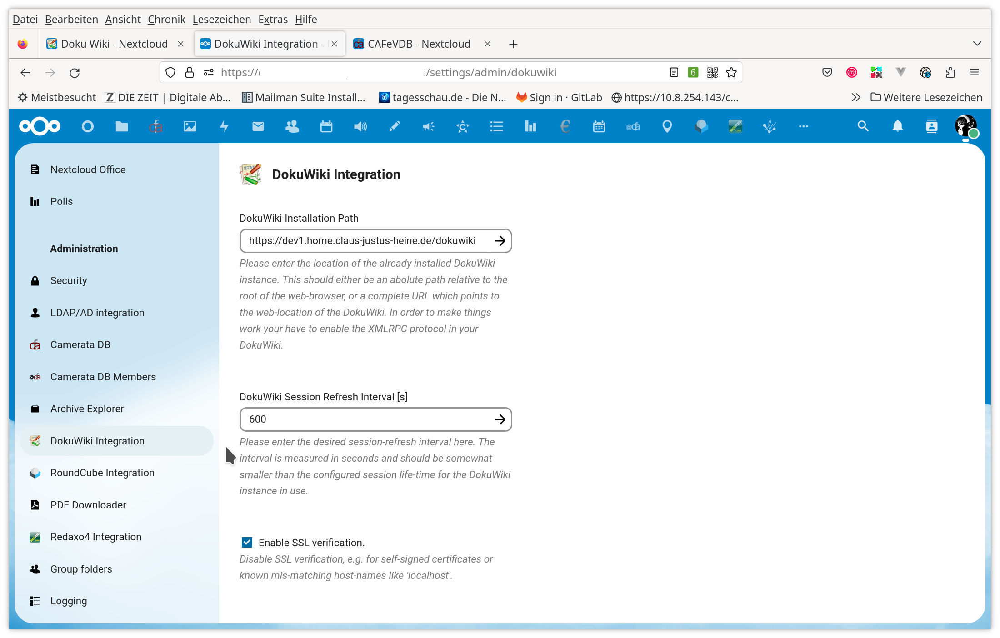
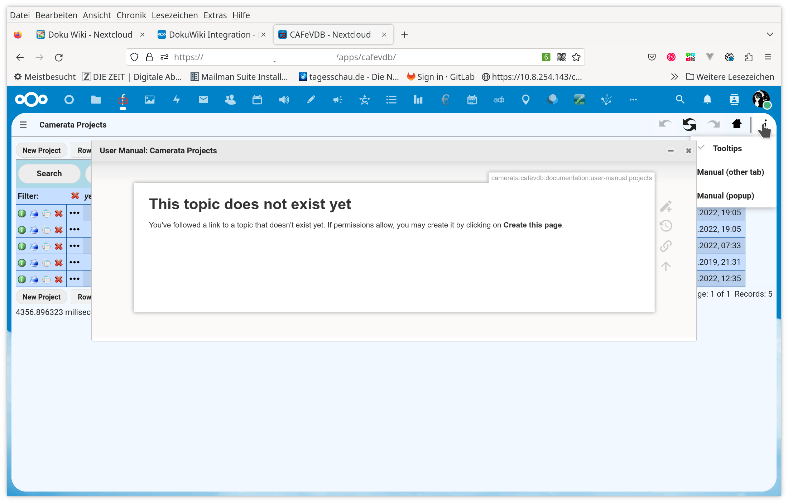

DokuWiki Integration for Nextcloud
==================================

<!-- markdown-toc start - Don't edit this section. Run M-x markdown-toc-refresh-toc -->
**Table of Contents**

- [Intro](#intro)
- [Installation](#installation)
- [Single Sign On](#single-sign-on)
  - [Using LDAP](#using-ldap)
  - [Using a DokuWiki Authentication Plugin](#using-a-dokuwiki-authentication-plugin)
- [Configuration](#configuration)
  - [Adminstration, Web-Server Setup](#adminstration-web-server-setup)
    - [TL;DR](#tldr)
    - [NC Domain equals DW Domain](#nc-domain-equals-dw-domain)
    - [Different Domains, but same Web-Server](#different-domains-but-same-web-server)
      - [Apache](#apache)
      - [Example for NGINX](#example-for-nginx)
    - [Different Domains, different Web-Server](#different-domains-different-web-server)
      - [Example for Apache](#example-for-apache)
      - [Example for NGINX](#example-for-nginx-1)
- [jQuery Popup](#jquery-popup)
- [More Documentation should follow ...](#more-documentation-should-follow-)
- [Screenshots](#screenshots)
  - [Start Page](#start-page)
  - [Admin Settings](#admin-settings)
  - [JQuery Popup](#jquery-popup)

<!-- markdown-toc end -->

# Intro

This is a Nextcloud app which embeds a Dokuwiki instance into a
Nextcloud server installation. If Dokuwiki and Nextcloud are
configured to use the same authentication backend, then this will work
with SSO, otherwise the login window of DokuWiki will appear in the
embedding iframe.

# Installation

- ~install from the app-store~ (not yet)
- install from a (pre-)release tar-ball by extracting it into your app folder
- clone the git repository in to your app folder and run make
  - `make help` will list all targets
  - `make dev` comiles without minification or other assset-size optimizations
  - `make build` will generate optimized assets
  - there are several build-dependencies like compose, node, tar
    ... just try and install all missing tools ;)

# Single Sign On

If DokuWiki and Nextcloud share a common user-base and authentication
scheme then the current user is just silently logged into the
configured DokuWiki instance and later the DokuWiki contents will just
be presented in an IFrame to the user.

## Using LDAP

The idea is here to use LDAP for the authentication for Nextcloud as
well as DokuWiki. In this case the user-names and passwords just
coincide.

It is still possible to have "local" accounts for Nextcloud and
DokuWiki, e.g. in order to have an administrator account which is
independent from LDAP in order not to run into a chicken-and-egg
problem.

## Using a DokuWiki Authentication Plugin

There is an experimental DokuWiki auth plugin using Nextcloud as
authentication source. Please refer to the original repository:

https://github.com/santifa/authnc.git

or to my own private fork

https://github.com/rotdrop/authnc

# Configuration

## Adminstration, Web-Server Setup

### TL;DR

Due to the technology used -- DokuWikix just runs in an
[iframe](https://developer.mozilla.org/en-US/docs/Web/HTML/Element/iframe) --
there are some restrictions caused by the [same origin
policy](https://developer.mozilla.org/en-US/docs/Web/Security/Same-origin_policy)
which at least nowadays is widely in use.

In principle this boils down to the point that the Nextcloud server
installation and the DokuWiki installation must be served in the same
DNS domain.

### NC Domain equals DW Domain

In this case nothing special has to be done. The administrator can
simply enter the location of the DokuWiki installation in the
adminstrator settings of the app.

### Different Domains, but same Web-Server

In this case the simplest thing is to just map the DokuWiki
installation a second time by a simple `Alias` directive.

#### Apache

Example for [Apache mod_alias](https://httpd.apache.org/docs/2.4/mod/mod_alias.html):

```
Alias /SOME_WEB_PATH PATH_TO_EXISTING_DOKUWIKI_INSTALLATION

```

This directive should be placed in the virtual host definition of
the Nextcloud server installation.

In the administration settings for the NC app you can then enter
whatever you have chosen for `/SOME_WEB_PATH`.

#### Example for NGINX

**Please Doc Me!**

### Different Domains, different Web-Server

In this case it is possible to map the existing external DokuWiki
installation into the Nextcloud server domain by means of a proxy
configuration mapping a local web-path to the external DokuWiki
server.

*If you try this then please first check the proxy settings
independent from the use of it in this app, i.e. just open the
proxied-location in you web-browser, log-in manually and check if it
works.*

#### Example for Apache

Place something like the following into the virtual host setup for
your Nextcloud server:

```
ProxyRequests Off
SSLProxyEngine on
<Location /SOME_WEB_PATH/>
    ProxyPass https://dokuwiki.my-domain.tld/
    ProxyPassReverse https://dokuwiki.my-domain.tld/
    ProxyPreserveHost Off
</Location>
```

Please note that you probably have `ProxyPreserveHost On` in the
configuration for the push notifications service.

#### Example for NGINX

```
location /SOME_WEB_PATH/ {
	proxy_pass https://dokuwiki.my-domain.tld/;
	proxy_set_header X-Forwarded-For $proxy_add_x_forwarded_for;
}
```
The "location /SOME_WEB_PATH/" folder paramter is used only as
example. This is the location you have to enter in Administrator
seetings of this Nextcloud app.  The
"https://dokuwiki.my-domain.tld" domain is used only as
example. Point to the domain where your DokuWiki is served from.

# jQuery Popup

DokuWiki may optionally be loading into a jQuery dialog, if
desired. To be documented ...

# More Documentation should follow ...

# Screenshots

## Start Page



## Admin Settings



## JQuery Popup


